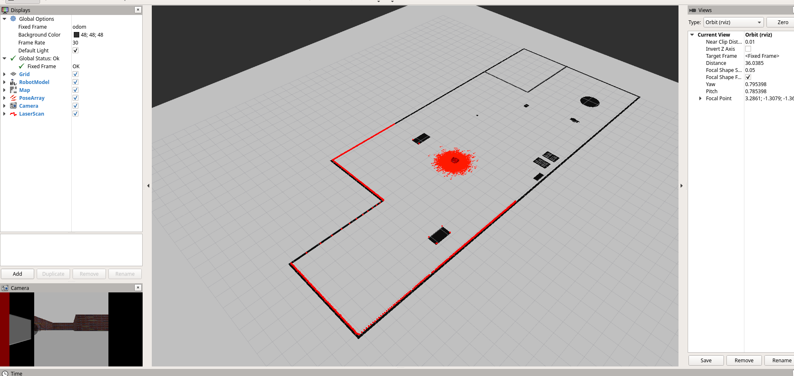
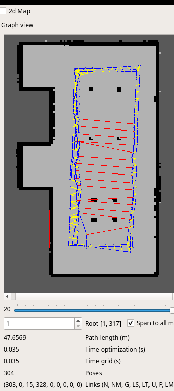

# Udacity

## Robotics Software Engineer
Nanodegree Programm \
[Link to Udacity](https://classroom.udacity.com/nanodegrees/nd209/dashboard/overview) \
Course accomplished in 10/2021

Example Screenshots: \

## Machine Learning
Free Course \
[Link to Udacity](https://classroom.udacity.com/courses/ud262)

## Introduction to Machine Learning
Free Course \
[Link to Udacity](https://classroom.udacity.com/courses/ud120)

## Intro To Inferential Statistics
Free Course \
[Link to Udacity](https://classroom.udacity.com/courses/ud201)

## Software Testing
Free Course \
[Link to Udacity](https://classroom.udacity.com/courses/cs258)
 